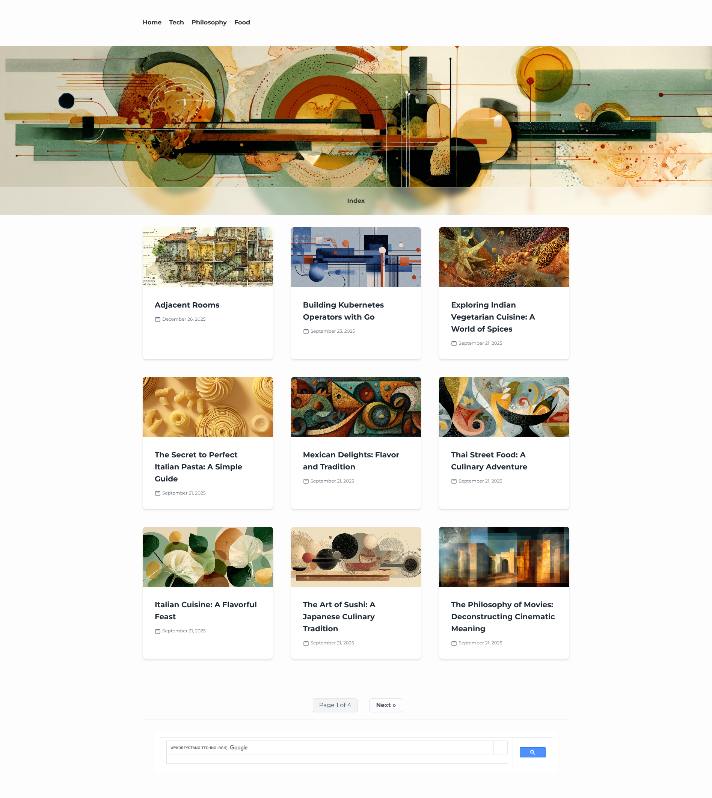
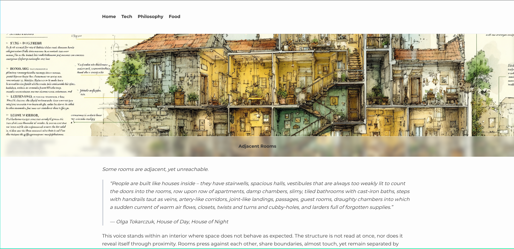
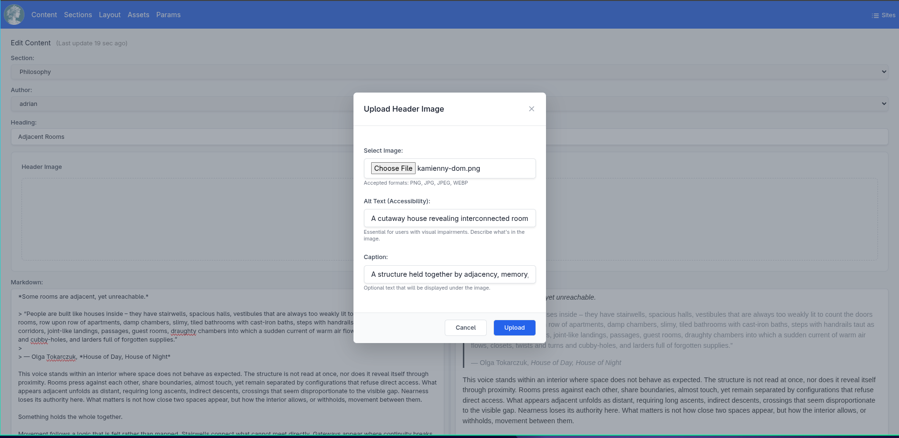
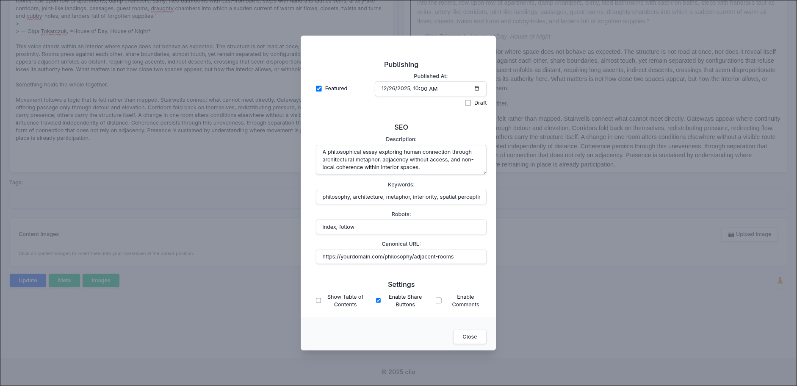
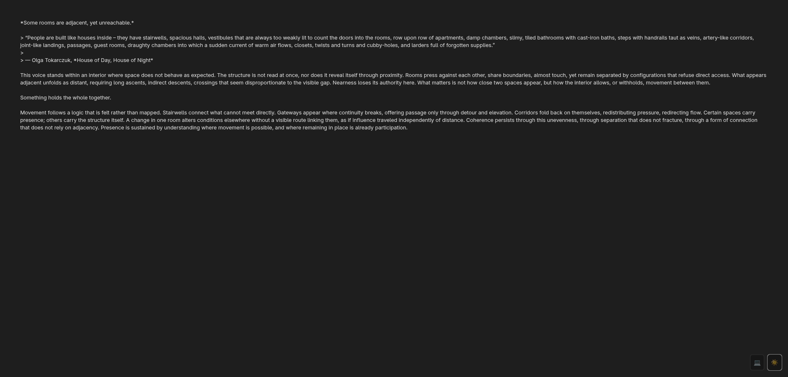
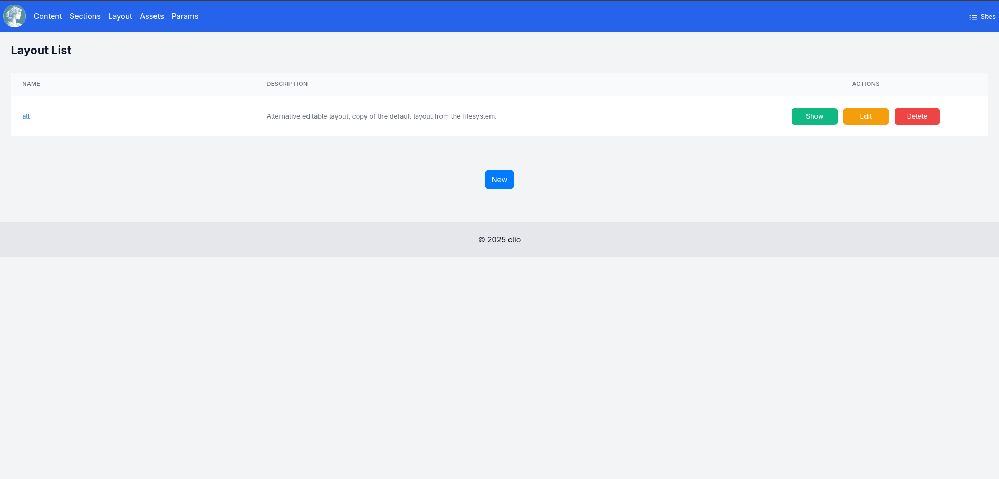
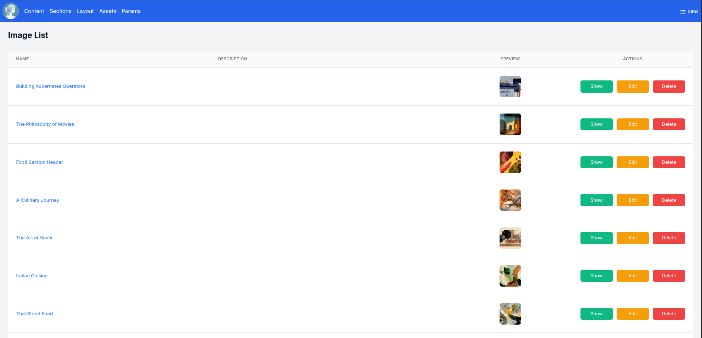
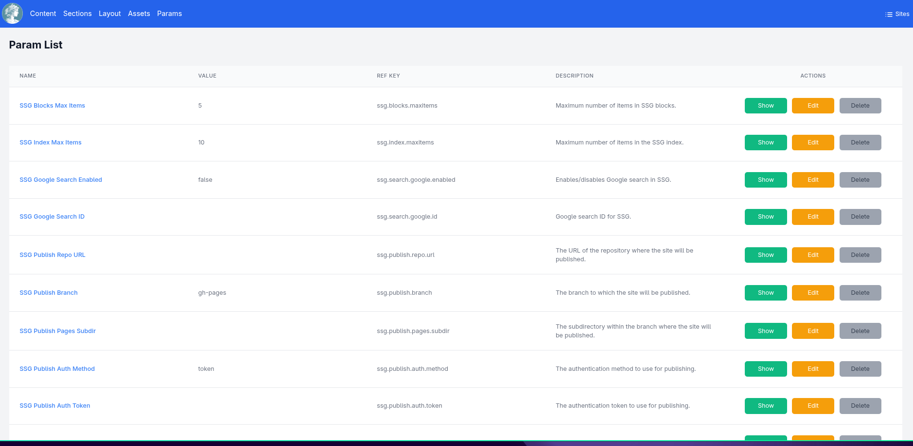
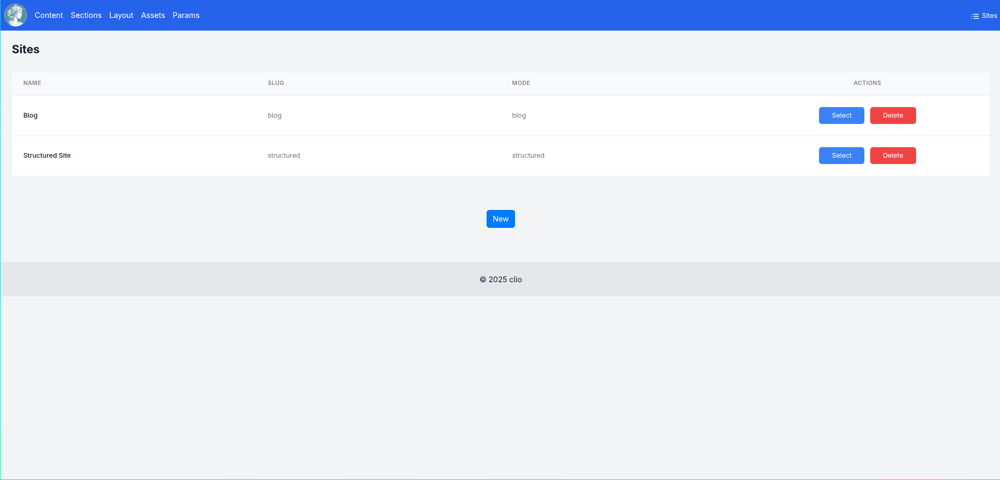

# Clio Gallery

This gallery showcases the features and interface of Clio, a lightweight static site generator.

## Site Index

The main site index page showing sections with header images and content listings.

## Rendered Content

View the final rendered HTML of your content with proper styling.

---

## Content Management

### Content List

Browse and manage all content in the system with filtering capabilities.

### Content Search

Search functionality to find content across your site.

### Image Upload

Upload header and content images with alt text and captions.

### Content Metadata

Edit publishing status, SEO fields, content type, and other metadata via a dedicated modal.

### Zen Mode with Dark Theme

Distraction-free writing environment with dark mode support for comfortable writing.

---

## Sections Management

Organize content into sections, each with its own header image and configuration.

---

## Layouts Management

Customize the HTML layout templates for your generated sites.

---

## Assets Management

### Image Library

Manage and browse uploaded images with thumbnails.

---

## Configuration Parameters

Configure site-wide settings and parameters.

---

## Sites Management

Manage multiple independent sites from a single Clio installation.

---

<i><a href="old/20251010-gallery.md">View previous gallery version...</a></i>

