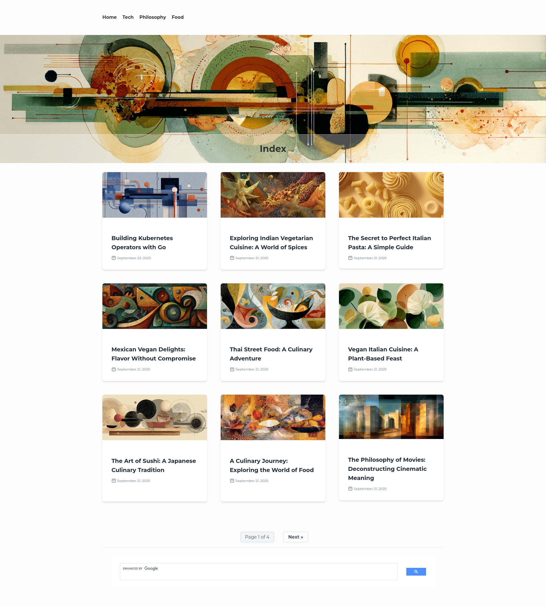
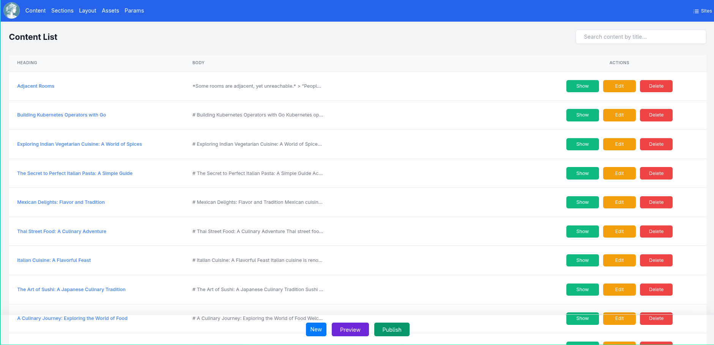

# Content Management Gallery

This gallery showcases the content management features of Clio.

## Index Page

The main index page showing the section with its header image and content listings.

## Content List

The main view for listing all the content available in the system. Soon, the listed results will be paginated to avoid long scrolls.

## New/Edit Content

The view for creating and editing content. It features a side-by-side markdown editor and preview, as well as fields for metadata like section, author, and tags.

## Metadata Editor

A dedicated modal for editing content metadata, including publishing status, SEO fields, and other settings.

## Zen Mode

A distraction-free writing environment that focuses solely on the markdown editor.

## Image Upload

Shows the image upload interface.

## New Content Editor

Shows the markdown editor with the new preview function for the header image and content images.

## Insert Image

Shows how pressing on a content image adds it at the document's insertion point.

## Section Images

Shows how it is now possible to "load" images that define the section's hero and the associated blog's image.

## Generated Markdown

An example of a generated markdown file, including some related content code blocks.

## Section Index

A draft of the section index page. Thumbnails currently display a default placeholder. Includes pagination controls and a configurable external search box (Google for now), which can be enabled via configuration.

---

# Header Styles Gallery

This section showcases the different header styles available in Clio.

## "Stacked" Style

The title is rendered below the image.

---

## "Overlay" Style

The title is rendered in white text centered directly on top of the image, with a dark scrim to ensure contrast.

---

## "Boxed" Style (Frosted Glass)

The default style. The title is rendered inside a frosted-glass effect stripe at the bottom of the image.

---

## "Text-Only" Style

A minimalist style with no header image, showing only the title.

